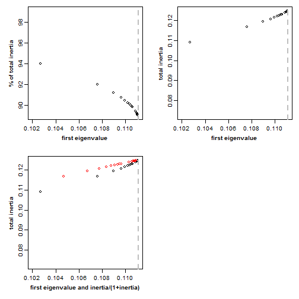
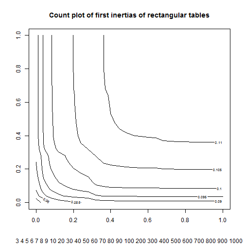

# Inertia Project  

The Inertia Project is a project initialized by Michael Greenacre to study the inertia values of Correspondence Analysis (CA).

## Repository outline

- **data** Results of computations  
- **miscellaneous** Script and information provided by Michael Greenacre  
- **compute_inertias.R** Functions to compute inertia summaries for rectangular frequency tables  
- **plotting.R** Plotting functions to study the results of computations  
- **main.R** a script for computations

Please see the main script for how to compute the results.

## (Very) preliminary results  

These are very crude drafts.  


Inertia values were computed for rectangular tables of sizes 3, 4, 5, 6, 7, 8, 9, 10, 20, 30, 40, 50, 60, 70, 80, 90, 100, 200, 300, 400, 500, 600, 700, 800, 900, 1000.
The results are in a list of matrices.


```
## List of 4
##  $ first   : num [1:26, 1:26] 0.0717 0.0775 0.0805 0.0823 0.0835 ...
##   ..- attr(*, "dimnames")=List of 2
##   .. ..$ : chr [1:26] "3" "4" "5" "6" ...
##   .. ..$ : chr [1:26] "3" "4" "5" "6" ...
##  $ others  : num [1:26, 1:26] 0.000702 0.00115 0.001448 0.001657 0.001811 ...
##   ..- attr(*, "dimnames")=List of 2
##   .. ..$ : chr [1:26] "3" "4" "5" "6" ...
##   .. ..$ : chr [1:26] "3" "4" "5" "6" ...
##  $ variance: num [1:26, 1:26] 0.00252 0.00291 0.00312 0.00325 0.00334 ...
##   ..- attr(*, "dimnames")=List of 2
##   .. ..$ : chr [1:26] "3" "4" "5" "6" ...
##   .. ..$ : chr [1:26] "3" "4" "5" "6" ...
##  $ skewness: num [1:26, 1:26] 0.0 0.0 0.0 -7.3e-17 0.0 ...
##   ..- attr(*, "dimnames")=List of 2
##   .. ..$ : chr [1:26] "3" "4" "5" "6" ...
##   .. ..$ : chr [1:26] "3" "4" "5" "6" ...
```

### Diagonals of the result matrices

The diagonals of the result matrices correspond to results from square tables.



### Contour plot of first inertias of rectangular tables



